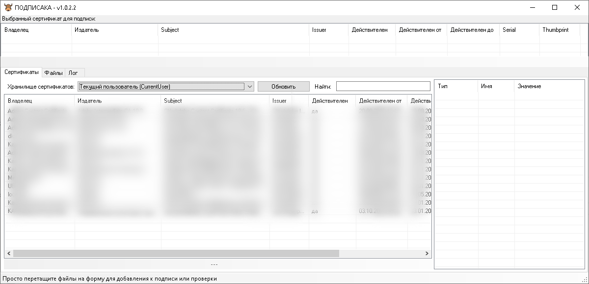

# ПОДПИСАКА

Утилита для подписания документов цифровой подписью и ее проверки, а также исполняемых файлов.

#### ИЗМЕНЕНИЯ ####
**v1.0.3.0**:
- Добавлена поддержка внедрения подписи в exe/dll/msi файлы (aka [signtool](https://learn.microsoft.com/ru-ru/windows/win32/seccrypto/signtool))

**v1.0.4.0**:
- Добавлена возможность изменгять алгоритм внутренней подписи pdf (sha-1/sha-256);
- Добавлена возможность корректировать шрифт подписи;
- Добавлена возможность располагать оттиск подписи на первой странице.
